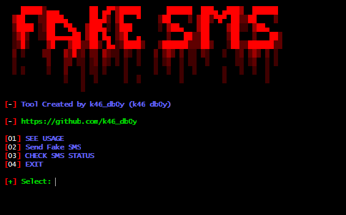

<!-- fake-sms -->

  

  
  
  
  
  

  
  
  

A Simple Script to send SMS anonymously..

##

<h3>
Disclaimer
</h3>

<i>Any actions and or activities related to <b>r3bu5</b> is solely your responsibility. The misuse of this toolkit can result in <b>criminal charges</b> brought against the persons in question. <b>The contributors will not be held responsible</b> in the event any criminal charges be brought against any individuals misusing this toolkit to break the law.

<b>This toolkit contains materials that can be potentially damaging or dangerous for social media</b>. Refer to the laws in your province/country before accessing, using,or in any other way utilizing this in a wrong way.

<b>This Tool is made for educational purposes only</b>. Do not attempt to violate the law with anything contained here. <b>If this is your intention, then Get the hell out of here</b>!

It only demonstrates "how phishing works". <b>You shall not misuse the information to gain unauthorized access to someones social media</b>. However you may try out this at your own risk.</i>

### Features:
     1. SMS ANONYMOUSLY
     2. SUPER FAST SMS SENDING
     3. INTERNATIONAL SMS SENDING AVAILABLE.
     4. YOU CAN SEND ONLY ONE SMS PER DAY.
     5. NO CHARGES ON SENDING SMS.
     6. VERY EASY TO USE.

### Installation:
     1. For Linux Users:
        a) git clone https://github.com/k46-db0y/fake-sms
        b) cd fake-sms then chmod +x run.sh
        
     2. For Termux Users:
        a) pkg update && pkg upgrade
        b) pkg install git
        c) git clone https://github.com/k46-db0y/fake-sms
        d) cd fake-sms then chmod +x run.sh
        
### Usage:
     Just Type:  bash run.sh
     
# Note:
     Use this script only for Educational Purpose.
     *) If u get the error like Your number was not provided in the E.164 format so wait for sometime.....
        the error is on the server side and will fix soon:)
     
 # This Tool Tested On:
     1. Parrot OS
     2. Kali Linux
     3. android ( Termux )
       
# Credit:
     If You Like This Tool then Kindly Give us a star. Thanks.....
     
### Find Me on :

  
  
  

